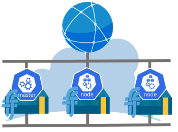

# terraform-nifcloud-minimum-k8s-cluster

This module deploys single-master Kubernetes cluster on NIFCLOUD using kubeadm.

This project is for develop environment, so please do not use this in production

## Overview



## Usage

There are examples included in the examples folder but simple usage is as follows:

```hcl
# Provider
provider "nifcloud" {
  region = "jp-west-1"
}

# Module
module "minimum_k8s_cluster" {
  source = "../../"

  availability_zone = "west-11"

  instance_key_name = "deployerkey"
}
```

Then perform the following commands on the root folder:

- `terraform init` to get the plugins
- `terraform plan` to see the infrastructure plan
- `terraform apply` to apply the infrastructure build
- `terraform destroy` to destroy the built infrastructure

## Inputs

| Name                   | Description                                                 | Type   | Default        |
| ---------------------- | ----------------------------------------------------------- | ------ | -------------- |
| availability_zone      | The availability zone                                       | string |                |
| prefix                 | Prefix to include in the name of the resource to be created | string | `001`          |
| private_network_subnet | The subnet of private network                               | string | `192.168.10.0` |
| instance_key_name      | The key name of the Key Pair to use for the instance        | string |                |
| instance_count_wk      | Number of worker to be created                              | number | `2`            |
| instance_type_wk       | The instance type of worker                                 | string | `e-large`      |
| instance_type_cp       | The instance type of control plane                          | string | `e-large`      |
| accounting_type        | Accounting type                                             | string | `1`            |

## Outputs

| Name                | Description                              |
| ------------------- | ---------------------------------------- |
| security_group_name | The security group used in the cluster   |
| worker_info         | The worker information in cluster        |
| control_plane_info  | The control plane information in cluster |

## Requirements

Before this module can be used on a project, you must ensure that the following pre-requisites are fulfilled:

1. Terraform are [installed](#software-dependencies) on the machine where Terraform is executed.
2. The Nifcloud Account you execute the module with has the right permissions.
    - You can set environment variable `NIFCLOUD_ACCESS_KEY_ID` and `NIFCLOUD_SECRET_ACCESS_KEY`

### Software Dependencies

- [Terraform](https://www.terraform.io/downloads.html) 1.3.7
- [Terraform Provider for Nifcloud](https://registry.terraform.io/providers/nifcloud/nifcloud/latest) 1.7.0

## Author

- Yoshitaka Fujii ([@ystkfujii](https://github.com/ystkfujii))